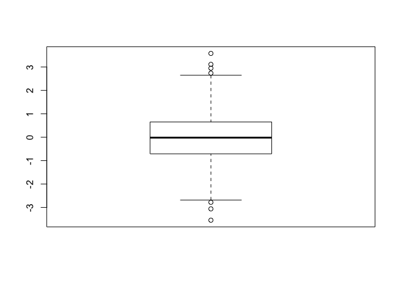
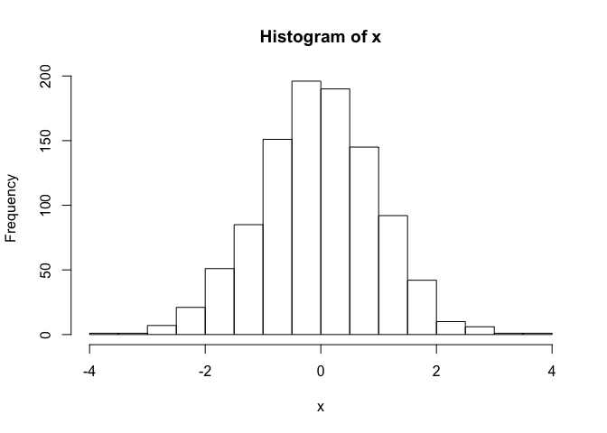
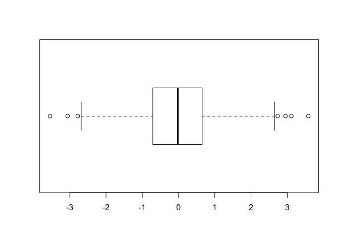
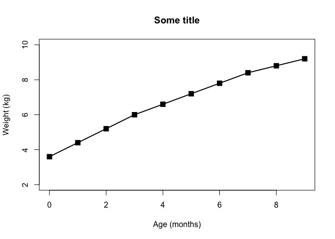
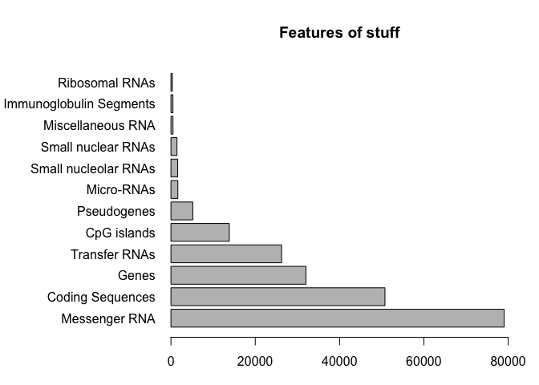
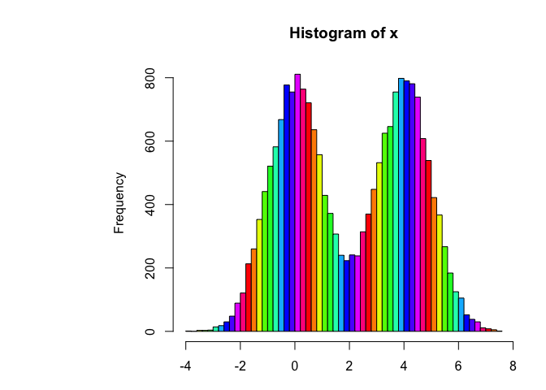
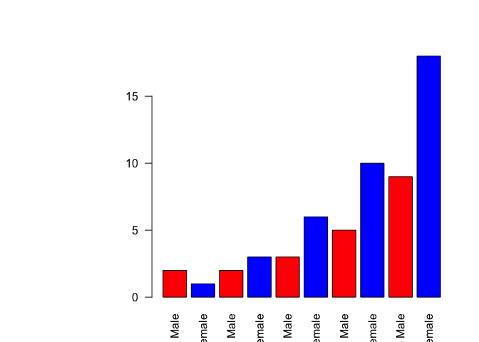
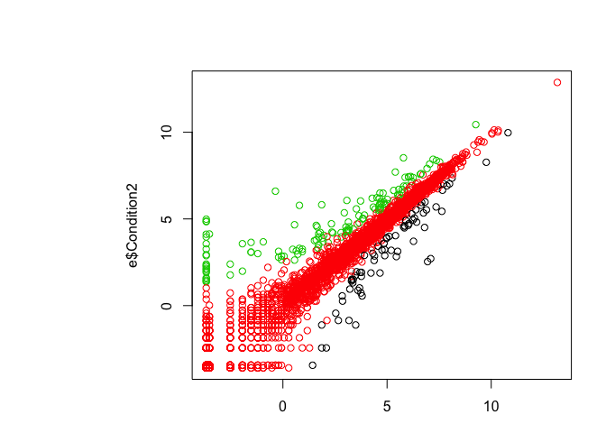
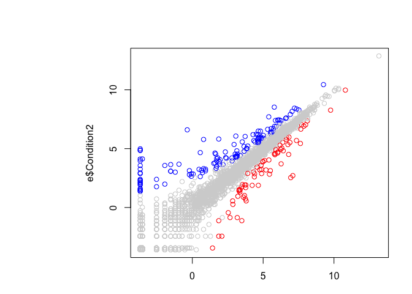

Class05 Intro to Graphics
================
Harpreet Setia
January 24th, 2019

``` r
# Class 5 R graphics intro

# My first box plot
x <- rnorm(1000,0)
boxplot(x)
```



``` r
summary(x)
```

    ##     Min.  1st Qu.   Median     Mean  3rd Qu.     Max. 
    ## -3.54420 -0.70815 -0.01855 -0.03447  0.65253  3.58047

``` r
hist(x)
```



``` r
boxplot(x, horizontal = TRUE)
```



``` r
# Hands on session 2
?read.table()
getwd()
```

    ## [1] "/Users/harpreetsetia/Desktop/BIMM 143/bimm143_github/class05"

``` r
list.files()
```

    ## [1] "bimm143_05_rstats" "class05.docx"      "class05.html"     
    ## [4] "class05.R"         "class05.Rproj"     "class05.spin.R"   
    ## [7] "class05.spin.Rmd"  "class05.tex"

``` r
weight <- read.table("bimm143_05_rstats/weight_chart.txt", header = TRUE)
weight
```

    ##    Age Weight
    ## 1    0    3.6
    ## 2    1    4.4
    ## 3    2    5.2
    ## 4    3    6.0
    ## 5    4    6.6
    ## 6    5    7.2
    ## 7    6    7.8
    ## 8    7    8.4
    ## 9    8    8.8
    ## 10   9    9.2

``` r
plot(weight, typ = "o", pch = 15, cex = 1.5, lwd = 2, ylim = c(2,10), xlab = "Age (months)", ylab = "Weight (kg)", main = "Some title")
```



``` r
?plot
feature_counts <- read.table("bimm143_05_rstats/feature_counts.txt", sep = "\t", header = TRUE)
#margin parameters are usually figured out by guess and check, have no set way of making that ez
par( mar = c (3.1, 11.1, 4.1, 2))
barplot(feature_counts$Count, horiz = TRUE, 
        ylab = "", names.arg = feature_counts$Feature, 
        las = 1, main = "Features of stuff", xlim = c(0,80000))
```



``` r
x <- c(rnorm(10000), rnorm(10000)+4)
hist( x, breaks = 80, col = rainbow(11))
```



``` r
par( mar = c (3.1, 11.1, 4.1, 2))
gender <- read.delim("bimm143_05_rstats/male_female_counts.txt", header = TRUE)
barplot(gender$Count,names.arg = gender$Sample, las = 2, col = c("red", "blue"))
```



``` r
#expression data
e <- read.table("bimm143_05_rstats/up_down_expression.txt", header = TRUE)

#how many genes
nrow(e)
```

    ## [1] 5196

``` r
#how many up, how many down and all around?
table(e$State)
```

    ## 
    ##       down unchanging         up 
    ##         72       4997        127

``` r
plot(e$Condition1, e$Condition2, col = e$State)
```



``` r
#play
palette(c("red", "lightgray","blue"))
plot(e$Condition1, e$Condition2, col = e$State)
```


